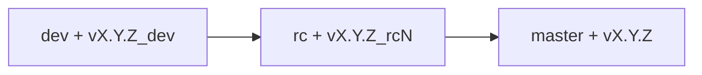

# Omybuntu Releases and Update Channels

This document is the source of truth for the Omybuntu release cycle,
branching strategy, version tags, and update channels.

## Supported release

Omybuntu 1.0 officially supports the Omybuntu AMD64 ISO built on Ubuntu
26.04. Other Ubuntu bases and CPU architectures are outside the supported
1.0 compatibility matrix.

## Branches and channels

| Channel | Git branch | Tag pattern | Stability |
|---|---|---|---|
| Stable | `master` | `vX.Y.Z` | Production |
| Edge | `master` | `vX.Y.Z` | Stable Omybuntu with rolling upstream packages |
| RC | `rc` | `vX.Y.Z_rcN` | Release candidate |
| Dev | `dev` | `vX.Y.Z_dev` | Experimental |

`master` is intentionally retained for compatibility with Omarchy upstream
and existing Omybuntu installations. `main` is not an Omybuntu release branch.

Release tags always contain exactly three numeric version components. Stable
1.0 uses `v1.0.0_rcN` and `v1.0.0`. Development follows its own forward-moving
version line, currently `v1.1.7_dev`; preparing stable 1.0 must not move,
replace, or recreate that dev tag. Older tags using a hyphen or four numeric
components are historical only and must not be reused for new releases.

## Promotion flow



1. Merge feature and bug-fix branches into `dev`. Advance its `vX.Y.Z_dev` tag
   only when the development version itself changes, never to name a stable
   release candidate.
2. Promote the approved commit to `rc`, then tag it as `vX.Y.Z_rcN`.
3. Complete the physical validation matrix in
   `release/checklists/vX.Y.Z.md`.
4. Promote the approved RC commit to `master`, change the checklist status to
   `approved`, and create the signed `vX.Y.Z` tag.

The GitHub repository is the source used by installed systems. GitLab builds
and publishes ISO releases. Promotion branches and tags must therefore be
pushed to both `origin` (GitHub) and `gitlab`. Push a release tag to GitLab to
start the pipeline, then mirror that immutable tag to GitHub only after the
pipeline passes. For the first stable release, publish `master` to GitHub only
after the stable pipeline and artifact verification pass, so installations
cannot select an unverified stable commit.

The CI rejects a tag that is not reachable from its required branch. Stable
tags are also rejected while their versioned physical checklist is missing,
pending, or contains unchecked items.

## Update discovery

`omybuntu-update-available` maps the selected channel to its branch, fetches
that branch and its tags from the installed repository's `origin`, and only
considers tags reachable from that branch. The installed version is the newest
matching tag reachable from `HEAD`.

Tags are ordered by version after strict channel-pattern filtering. Dev accepts
only `_dev`, RC accepts `_rcN`, and stable accepts no suffix.

When an update is selected, `omybuntu update` pulls the active branch, runs
timestamped migrations, and updates system packages through APT.

## CI release requirements

Every tag pipeline runs the CLI, ISO integrity, update discovery, and release
validation tests before building the ISO. The build publishes these files in
the GitLab Generic Package Registry and links them from the GitLab Release:

- `omybuntu-vX.Y.Z-amd64.iso`
- `omybuntu-vX.Y.Z-amd64.iso.sha256`
- `omybuntu-vX.Y.Z-amd64.iso.sig`
- `omybuntu-release-key.asc`

Configure these GitLab CI/CD variables before creating a release tag:

| Variable | Type | Protection |
|---|---|---|
| `OMYBUNTU_RELEASE_GPG_PRIVATE_KEY` | File | Protected |
| `OMYBUNTU_RELEASE_GPG_PASSPHRASE` | Variable, masked | Protected |
| `OMYBUNTU_RELEASE_GPG_FINGERPRINT` | Variable | Protected |
| `OMYBUNTU_RELEASE_KNOWN_ISSUES` | Variable | Protected |

Protect the `v*` tag pattern so protected signing variables are available only
to authorized release pipelines. The fingerprint variable is optional but
recommended; when set, the pipeline rejects a different imported key. The
private key and passphrase must never be committed to the repository.

Manual, untagged pipelines run the same tests and produce an unsigned build
artifact, but they do not create a public GitLab Release.

## Release verification

Download the ISO, checksum, signature, and public key into one directory, then
run:

```bash
sha256sum --check omybuntu-v1.0.0-amd64.iso.sha256
gpg --import omybuntu-release-key.asc
gpg --fingerprint
gpg --verify omybuntu-v1.0.0-amd64.iso.sig omybuntu-v1.0.0-amd64.iso
```

Compare the displayed fingerprint with the fingerprint printed in the GitLab
release notes before trusting the signature.
